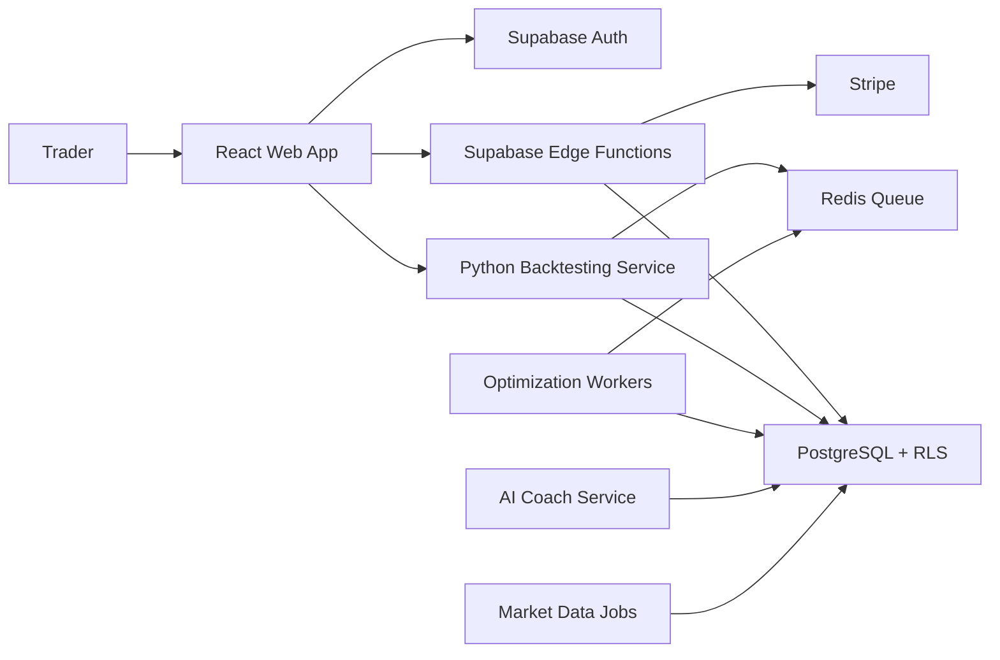

# System Architecture

## High-Level Design

QuantEdge is a multi-tenant SaaS platform built around user-owned data, objective backtesting, and AI-assisted review.

## Core Services

- `apps/web`: strategy builder, dashboard, journal, replay controls, analytics.
- `supabase`: authentication, row-level isolation, storage, realtime events, audit logs.
- `services/backtester`: deterministic simulation, metrics, walk-forward analysis, optimization, Monte Carlo.
- `workers`: parallel backtests, historical data ingestion, AI report generation.
- `edge functions`: broker imports, subscription webhooks, notification triggers.

## Scalability

- Candle data is partitioned by symbol and timeframe.
- Backtests run asynchronously in queue workers.
- Optimization jobs use fan-out/fan-in execution.
- Read-heavy analytics are cached in Redis and materialized views.
- User data is isolated by organization and enforced through RLS.

## AI Boundaries

AI explains, critiques, and summarizes. It does not invent P/L, mutate backtest results, or bypass deterministic metrics. All coaching output references stored trades, strategy rules, and computed statistics.

