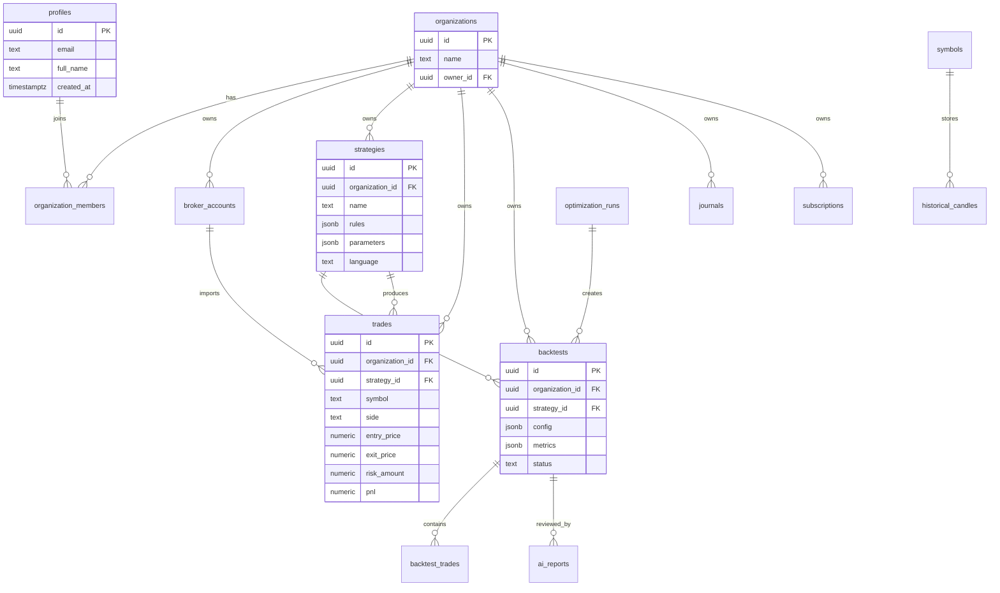

# Entity Relationship Diagram

```mermaid
erDiagram
  organizations ||--o{ organization_members : has
  profiles ||--o{ organization_members : joins
  organizations ||--o{ broker_accounts : owns
  organizations ||--o{ strategies : owns
  organizations ||--o{ trades : owns
  organizations ||--o{ backtests : owns
  organizations ||--o{ journals : owns
  organizations ||--o{ subscriptions : owns
  strategies ||--o{ backtests : tested_by
  strategies ||--o{ trades : produces
  broker_accounts ||--o{ trades : imports
  backtests ||--o{ backtest_trades : contains
  backtests ||--o{ ai_reports : reviewed_by
  optimization_runs ||--o{ backtests : creates
  symbols ||--o{ historical_candles : stores

  profiles {
    uuid id PK
    text email
    text full_name
    timestamptz created_at
  }

  organizations {
    uuid id PK
    text name
    uuid owner_id FK
  }

  strategies {
    uuid id PK
    uuid organization_id FK
    text name
    jsonb rules
    jsonb parameters
    text language
  }

  trades {
    uuid id PK
    uuid organization_id FK
    uuid strategy_id FK
    text symbol
    text side
    numeric entry_price
    numeric exit_price
    numeric risk_amount
    numeric pnl
  }

  backtests {
    uuid id PK
    uuid organization_id FK
    uuid strategy_id FK
    jsonb config
    jsonb metrics
    text status
  }
```

