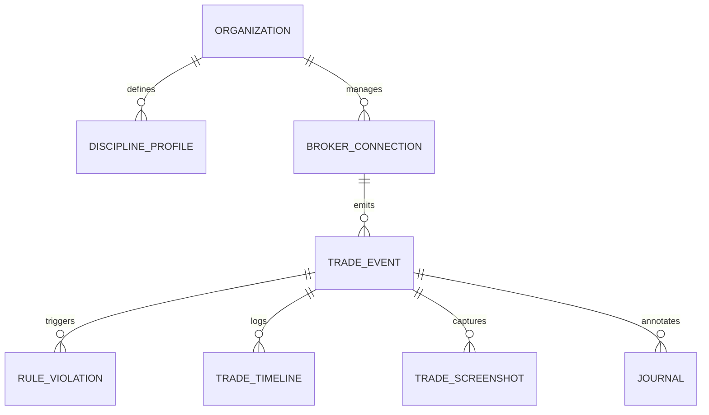

# QuantEdge Phase 5: Discipline Guardian™ Design Document

## 1. Architecture Overview
The Discipline Guardian™ transforms QuantEdge into a behavioral analysis engine. It shifts focus from strategy performance to trader performance by comparing actual execution against a pre-defined rulebook.

### Components:
1. **Rulebook Registry**: Management of `discipline_profiles`.
2. **Connector Hub**: Scalable ingestion layer for MT4/5, cTrader, IBKR, and CSV.
3. **Discipline Pipeline**: Real-time validation of trade events against profile rules.
4. **Scoring Engine**: Calculation of temporal compliance scores (Execution, Risk, Psychology).
5. **Journey Timeline**: Unified UI presenting the complete "Case File" for every trade.

---

## 2. Database Schema (Normalized)

### `discipline_profiles`
Stores the trader's configurable rulebook.
| Column | Type | Description |
|--------|------|-------------|
| id | UUID (PK) | Unique ID |
| organization_id | UUID (FK) | Workspace isolation |
| name | TEXT | Profile name (e.g., "Prop Firm Conservative") |
| rules | JSONB | Structured rules (max_loss, allowed_hours, etc.) |
| is_active | BOOLEAN | Only one active profile per workspace |
| created_at | TIMESTAMPTZ | Audit trail |

### `broker_connections`
Manages external data sources.
| Column | Type | Description |
|--------|------|-------------|
| id | UUID (PK) | Unique ID |
| organization_id | UUID (FK) | Workspace isolation |
| provider | ENUM | mt5, mt4, ibkr, ctrader, csv, dx_trade |
| status | ENUM | connected, disconnected, auth_failed |
| last_sync_at | TIMESTAMPTZ | To avoid duplicate processing |

### `trade_events`
Permanent record of live/broker trades (Internal Format).
| Column | Type | Description |
|--------|------|-------------|
| id | UUID (PK) | Unique ID |
| broker_connection_id | UUID (FK) | Source link |
| external_id | TEXT | ID from the broker (e.g., Ticket #) |
| symbol | TEXT | Instrument name |
| entry_price | NUMERIC | Execution price |
| exit_price | NUMERIC | Exit price |
| pnl | NUMERIC | Net profit/loss |
| is_compliant | BOOLEAN | Cached result from Discipline Engine |

### `rule_violations`
Evidence of broken rules.
| Column | Type | Description |
|--------|------|-------------|
| id | UUID (PK) | Unique ID |
| trade_event_id | UUID (FK) | Reference to trade |
| rule_key | TEXT | Slug of the broken rule (e.g., "early_exit") |
| expected_value | TEXT | Value required by rulebook |
| actual_value | TEXT | Value executed by trader |
| severity | ENUM | warning, breach, critical |

---

## 3. ER Diagram (Conceptual)

---

## 4. API Design (Guardian Service)

### Discipline Profile
- `GET /api/v1/discipline/profile`: Fetch current rulebook.
- `PATCH /api/v1/discipline/profile`: Update trading rules.

### Trade Ingestion
- `POST /api/v1/ingest/webhook/:provider`: Endpoint for real-time broker webhooks.
- `GET /api/v1/ingest/sync/:connection_id`: Trigger manual background sync.

### Scoring & Reports
- `GET /api/v1/discipline/score?period=daily`: Get current discipline health.
- `GET /api/v1/discipline/reports/:report_id`: Fetch institutional monthly report.

---

## 5. Security & Performance
- **Credentials**: All broker API keys/tokens are encrypted at rest (AES-256) within Supabase Vault or similar.
- **Background Jobs**: Trade validation (Discipline Engine) runs as an asynchronous Edge Function to ensure UI responsiveness.
- **Rate Limiting**: Throttling on sync requests to avoid broker API bans.

---

## 6. Future Expansion
- **Guardian AI**: Predict breaches before they happen based on sentiment analysis of current journals.
- **Automated Screenshots**: Companion desktop app to capture terminal state on trade open/close.
- **Risk Kill-Switch**: Integration with brokers to automatically disable trading if "Critical Breach" occurs.
