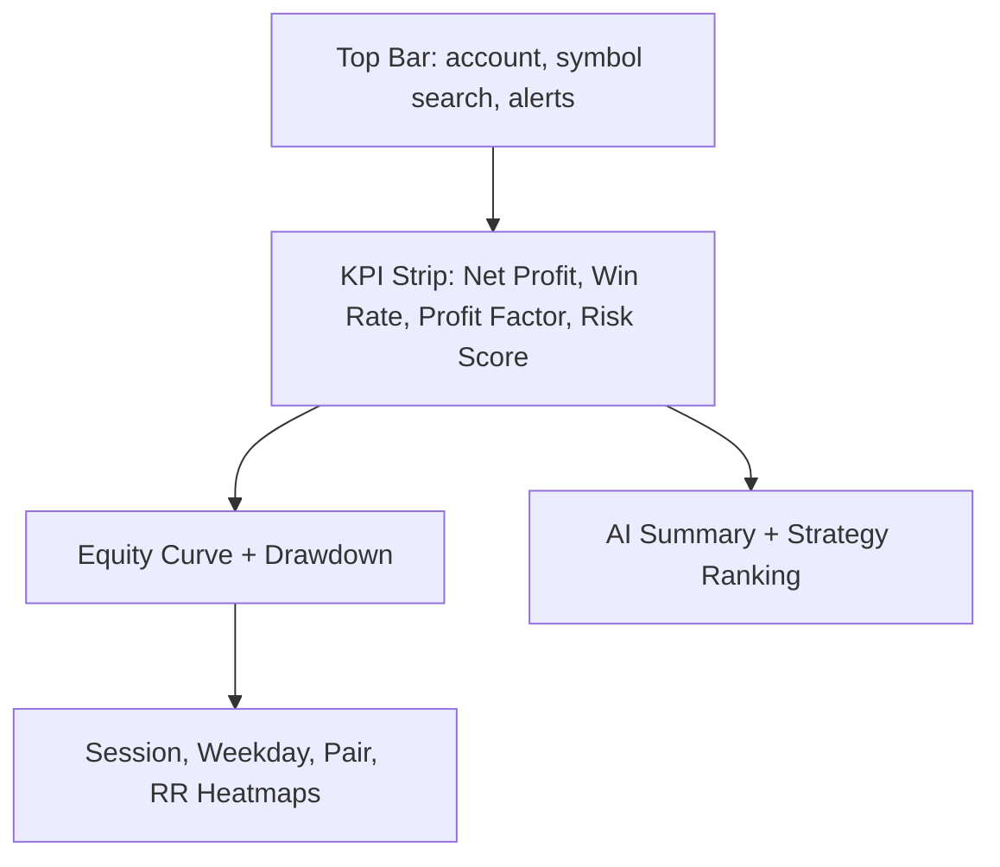

# UI Wireframes And Component Library

## Primary Navigation

- Dashboard
- Strategy Builder
- Backtests
- Replay
- Journal
- Edge Finder
- Portfolio
- Risk
- Reports
- Settings

## Dashboard Layout

## Component Inventory

- `MetricCard`: compact KPI with trend and status.
- `EquityCurve`: responsive line chart.
- `Heatmap`: edge discovery matrix.
- `StrategyBuilder`: visual rule groups and code editor tabs.
- `TradeTable`: sortable trades with violations and tags.
- `ReplayControls`: play, pause, speed, step, date jump.
- `AiCoachPanel`: report summary, rule violations, suggested experiments.
- `RiskGuardrailPanel`: daily limits, drawdown, streak warnings.

## Design Language

Dark, fast, and dense. The interface prioritizes scanning, comparison, and repeated professional workflow. Glass treatment is subtle and limited to overlays and panels.

